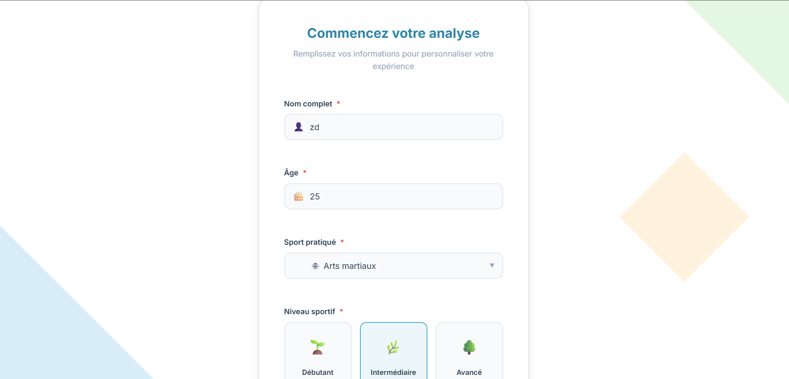
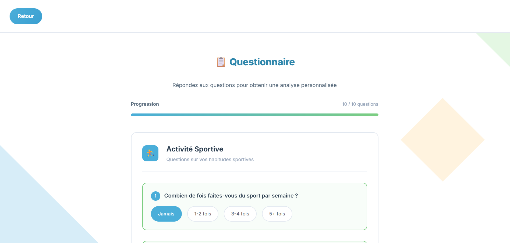
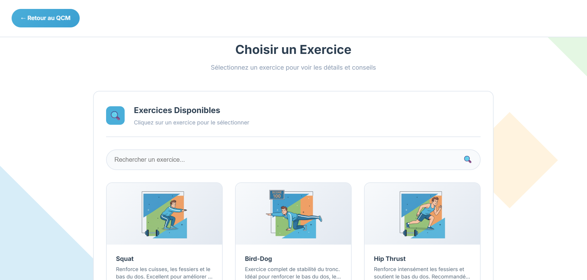
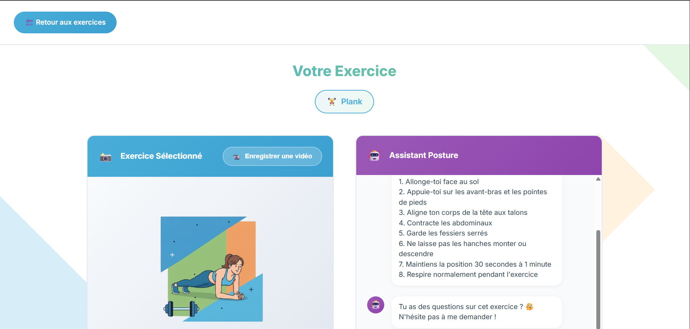

# 🏋️‍♂️ Antigravity | Web App d’Évaluation Sportive & Posturale + RAG Architecture

## Table of Contents
- [Overview](#overview)
- [Screenshots](#screenshots)
- [RAG Chatbot System Architecture](#rag-chatbot-system-architecture)
- [Key Features](#key-features)
- [System Architecture](#system-architecture)
- [Technologies](#technologies)
- [Getting Started](#getting-started)
- [Project Structure](#project-structure)
- [License](#license)
- [Author](#author)

---

## 📌 Overview

**Antigravity** est une application web interactive permettant :

✔ d’évaluer la posture et les habitudes sportives via un questionnaire (QCM),  
✔ de choisir un exercice parmi des illustrations professionnelles,  
✔ d’obtenir une fiche complète de l’exercice sélectionné,  
✔ d’avoir des instructions détaillées étape par étape,  
✔ d’utiliser un mini-chat posture pour recevoir de l’aide,  
✔ et d'intégrer un module **RAG (Retrieval-Augmented Generation)** pour les questions avancées.

Le projet est 100% **HTML / CSS / JavaScript + JSON**, sans backend.

---

## 🖼️ Screenshots

### 🔹 Page 1 — Informations utilisateur


### 🔹 Page 2 — Questionnaire sport & posture


### 🔹 Page 3 — Choisir un exercice


### 🔹 Page 4 — Exercice sélectionné + Assistant Posture

---

## 🧠 RAG Chatbot System Architecture


---

## 🧠 RAG Chatbot System Architecture

Le schéma suivant montre l’architecture complète du système RAG utilisé dans le projet, incluant :

- ingestion de documents PDF/DOCX,
- chunking et transformation du texte,
- génération d’embeddings,
- indexation vectorielle,
- retrieval,
- LLM (Gemma 2B),
- conversation memory,
- gestion du chat utilisateur.


---

## ⭐ Key Features

### 🎯 1. QCM Sport & Posture  
Analyse du niveau sportif, des douleurs potentielles et de la posture.

### 🔍 2. Recherche d’un Exercice  
Page dédiée permettant de rechercher et sélectionner un exercice illustré.

### 🏋️ 3. Fiche Exercice Détaillée  
Affiche :  
- image de l’exercice,  
- description complète,  
- étapes d’exécution,  
- recommandations posturales.

### 🤖 4. Assistant Posture (Mini-Chat)  
Répond aux questions basiques sur l’exercice sélectionné.

### 🧠 5. RAG Chatbot (Optionnel – Avancé)  
Permet :  
- Q/A basées sur des documents PDF/DOCX,  
- récupération de contexte via embeddings,  
- réponses générées par un LLM avec contexte ajouté.

### 📱 6. Design Responsive  
Compatible mobile, tablette et ordinateur.

### 📁 7. JSON Data Pipeline  
Tous les exercices (nom, image, steps…) proviennent de **exercices.json**.

---

## 🏗️ System Architecture (Frontend App)

```text
HTML / CSS / JavaScript
           │
       exercices.json
           │
     LocalStorage API
           │
Pages dynamiques :
Page 1 → Page 2 → Page 3 → Page 4
